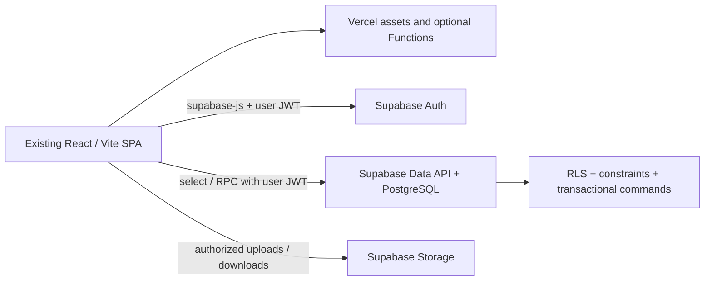

> Historical design: runtime access and mutation requirements are superseded by [the public-read, owner-only CRUD contract](../../supabase/RUNTIME.md). Do not implement the earlier conflict, retry receipt or private-browsing proposals.

# Vercel application and Supabase persistence

Status: proposed architecture for PR #9; documentation only. Reviewed 2026-10-03 against PR head `e271b7b` and local `main` snapshot `9256ece38eab7490633682d4630cf603e1178d13`. No live data, cloud resources, credentials, or deployments were inspected or changed.

## Direction and decision gates

The user has chosen **Vercel for dynamic application hosting and Supabase for PostgreSQL and Storage**, with work ordered **relational schema first, JSON migration second, database read/write integration third**. This replaces the previous homelab web/API/database containers, Drizzle/`pg` runtime, GHCR release pair, trusted-LAN header authorization, and host polling proposal. The current running JSON app remains unchanged until a separately authorized cutover.

Keep the React/Vite/TypeScript application and current UI. Dynamic persistence does not require SSR, Next.js, a framework rewrite, npm workspaces, or a permanent Express server. Vercel serves the built SPA; Supabase serves authenticated data and storage requests. Add a Vercel Function only for a concrete server-only operation that cannot reasonably live in the database or Supabase client. [Vercel's Vite integration](https://vercel.com/docs/frameworks/frontend/vite) supports the existing framework and optional Functions.

Read these documents in order:

1. [Relational schema, identities, security, and catalog/media boundaries](supabase-schema.md).
2. [JSON migration, validation, reconciliation, and cutover](supabase-migration.md).
3. This document's runtime contract, then [preview/production delivery and rollback](vercel-supabase-delivery.md).

| Status | Decision |
| --- | --- |
| User-set | Vercel hosting; Supabase database/storage; schema → migration → read/write code; docs only now; preserve UI and safeguards. |
| Recommended for approval | One owner account through Supabase Auth; private collection initially; owner-only mutations through transactional PostgreSQL RPC; `supabase-js` for reads, RPC, Auth, and Storage. |
| Recommended for approval | Keep sourced reference catalogs in Git; no invented media import; preserve legacy string inventory IDs; independent stable journal IDs and ordering sequence. |
| Open, must resolve at schema gate | Exact owner identity and login provider; whether anonymous public browsing must remain (and precisely which fields/media are public); collection timezone; field limits; media scope; journal edit-audit retention, if desired. |
| Open, resolve before deployment | Supabase/Vercel projects, regions, plans and recovery capabilities; isolated preview database strategy; production domain and Auth redirect URLs; operator/release approval process. |

**Gate A — schema approval:** obtain explicit approval of the linked table/constraint model, permissions, history/queue semantics, source mapping, and open product decisions before writing schema SQL, an importer, or application persistence code. Acceptance of Vercel/Supabase alone is not acceptance of every recommendation. If public browsing is required, revise the security design before implementation; do not silently expose the private model or silently remove a confirmed browsing requirement.

**Gate B — migration acceptance:** after approved versioned SQL exists, demonstrate a repeatable import into a disposable database, with field-level and derived-view reconciliation, failure rollback, and idempotency. Then implement database reads/writes. A read-only parity harness is part of importer validation, not early production client integration.

**Gate C — release authorization:** separately authorize isolated nonproduction cloud setup before preview testing. Production cutover requires a tested candidate, approved fresh live-data capture, verified permission matrix, and rehearsed recovery plan. Approval of these documentation changes does not itself authorize cloud provisioning or production data operations. Subsequent explicit user authorization may start a separate implementation/setup task; the schema/product gates still apply.

## Evidence from the application

| Evidence | Behavior to retain or repair |
| --- | --- |
| [`types.ts`](../../src/models/types.ts) | Pen/ink string IDs, archive/favorite flags, `needsRefill`, optional custom color; journal date, pen, ordered inks, notes, residual-ink flag. |
| [`collection.ts`](../../src/lib/collection.ts) | Latest pairing uses date then actual array position; future events excluded from current pairing; counts/history retain events; `NONE` means cleaning; mixtures and residual ink are distinct. |
| [`server/refill-api.js`](../../server/refill-api.js) | Journal already uses per-entry operations with expected-original conflict checks and serialized atomic file replacement. Replace this protection with IDs/versions, never whole-journal replacement. |
| [`RefillEditor.tsx`](../../src/components/collection/RefillEditor.tsx) | New latest events can change queue intent; historical edits cannot. Event and pen currently save separately; make them one transaction. |
| [`dataService.ts`](../../src/services/dataService.ts), [`fileService.ts`](../../src/services/fileService.ts) | Module state and JSON persistence; some writes return before persistence. All new mutations must await database confirmation. |
| [`useEditorNavigation.ts`](../../src/hooks/useEditorNavigation.ts) | Journal navigation uses shifting indices; migrate routes, drafts, and keys to stable event IDs while keeping Back/Forward and unsaved drafts. |
| [`inkReference.ts`](../../src/lib/inkReference.ts) | Pilot/Wearingeul records join by brand and inventory ID; sourced facts and color precedence must survive. |
| [`LocalNetworkContext.tsx`](../../src/context/LocalNetworkContext.tsx), [`server.js`](../../server.js), [`vite-file-api-plugin.ts`](../../vite-file-api-plugin.ts) | Network detection/UI controls do not enforce authorization. Remove persistence endpoints and LAN-based capability checks only during integration/cutover; RLS/RPC must enforce access independently of UI. |

The branch snapshot has 49 pens and 483 journal entries. The newer local `main` snapshot has 50 pens, 194 real inks plus `NONE`, 486 events, and 507 real event/ink links. These are rehearsal observations, **not production truth**. The [migration audit](supabase-migration.md#source-audit) distinguishes the snapshots and records the fixed source and its one-time import checks.

## Runtime boundary and repository shape

Keep existing `src/` paths initially. Add `src/services/supabaseClient.ts`, a typed collection adapter, generated database types, and pure DTO/domain validation where they fit; avoid moving every component as part of persistence work. Proposed later directories are `supabase/migrations/`, `supabase/tests/`, and `scripts/migration/`. Optional `api/` Functions are narrowly scoped server entry points, not a second generic CRUD API. Do not add those files in this design PR.

Use `@supabase/supabase-js` for session management, authorized reads, `.rpc(...)`, and Storage. It is an HTTP client; a series of awaited `.insert()`/`.update()` calls is **not one database transaction**. Multi-table writes, version checks, idempotency receipts, and queue changes belong in a PostgreSQL function invoked once through RPC. [Supabase database functions](https://supabase.com/docs/guides/database/functions) describes client-callable SQL functions and their security modes.

No Drizzle or direct `pg` runtime pool is needed for this plan. A controlled migration/import CLI can use a PostgreSQL connection for one transaction. If a future Vercel Function truly needs direct SQL, use the connection method suitable for its runtime and pooler limitations; never open an unbounded pool per request. Prefer user-scoped `supabase-js` in a Function when that suffices. [Supabase connection guidance](https://supabase.com/docs/guides/database/connecting-to-postgres).

### Read contract

Recommend one `get_collection()` read RPC that builds `{ pens, inks, events, asOf, capabilities }` in a single SQL statement/snapshot, orders events and ink links explicitly, and runs as `SECURITY INVOKER` under RLS. This avoids inconsistent event/queue reads and default row limits silently truncating a future collection. Return every event for current UI parity; revisit pagination only with an explicit contract and tests. Filter by the authorized owner, derive `asOf` from the approved collection timezone, and expose no private configuration/import receipts. A returned capability is UI guidance, never authorization.

Map SQL snake_case to explicit camelCase DTOs. Represent `occurred_on` as `YYYY-MM-DD`, never a UTC timestamp. Represent the ordering bigint as a decimal string (compare safely without JS precision loss), or enforce an approved safe integer range. Preserve independent event `id`, `version`, and `sequence`. New domain DTOs use `kind: 'cleaning'` with `inkIds: []`; temporarily adapt `NONE` only at the existing UI boundary until components are converted.

Replace global arrays with a query-backed state layer (TanStack Query is a recommendation, not a prerequisite). Initially fetch the complete collection; retain pure filtering/derivation. Refetch after commit, focus, and reconnect; clear owner data on sign-out/account change and scope cache keys to the user. Never fall back to bundled mutable JSON when Supabase fails. Show loading, empty, read-only, and unavailable states distinctly.

### Mutation contract

Recommended RPCs: `create_pen`, `update_pen`, `delete_pen`, equivalent ink commands, and `create_refill_event`, `update_refill_event`, `delete_refill_event`. Every update/delete accepts `expectedVersion`; every mutation accepts a client-generated `requestId` for safe resolution of uncertain responses. RPCs derive the owner from authenticated identity; they never trust caller-supplied owner IDs, versions to set, ordering values, or timestamps.

A command validates field allowlists, bounded strings, real calendar dates, boolean types, reference existence/ownership, and ink uniqueness. Omitted PATCH fields remain unchanged; explicit `colorHex: null` clears a custom color. Reject `NONE` in the database contract and reject unknown fields. Enforce these rules inside the database command as well as in the client, since clients can call RPC directly. New/edited events cannot be future-dated according to the approved timezone; historical import validation reports such rows for a decision instead of discarding them.

Return committed records, affected pen, and versions. Map typed database failures into stable adapter errors: unauthenticated, forbidden, validation, not-found, conflict, referenced-record, unavailable. Supabase/PostgREST controls HTTP status mapping; do not promise an Express-specific 201/204/409 response shape. Do not show raw SQL errors. Preserve drafts on any failure or conflict and require review before overwriting another tab's changes.

Disable duplicate submits and automatic mutation retries initially. If a response is lost, reuse the **same** request ID and payload to query/replay the receipt; never allocate another ID and blindly create a second event. A new deliberate identical refill gets a new request ID and remains valid. Receipt handling and transaction locking are defined in [the schema](supabase-schema.md#transactional-command-boundary).

Save feedback/celebrations occur only after commit confirmation. A failed refresh after a confirmed commit is a refresh error, not a failed save. Remove the Git push/save dialog and saved-but-unpushed state after database cutover; retain unsaved-form guards, nested creation, filters, scroll restoration, editor navigation, desk layout, favorites, queue, reference stories, and accessibility. Old index bookmarks should ask the user to reopen the entry from the journal, not guess an identity.

### Auth, storage, and optional server functions

Use Supabase Auth plus the single-owner allowlist and table/storage policies in [the schema](supabase-schema.md#authorization-and-secrets). Invite/provision the chosen account administratively; disable open signup for this single-owner app, but also deny other authenticated identities at the database layer. Hiding a Save button or checking email in React is insufficient.

A Vercel Function is appropriate for a future external service secret, privileged media processing, or administrative operation with independently verified authorization. Normal inventory/journal CRUD and private Storage access need no Function proxy. If added, verify the caller's token through supported Supabase verification, retain user-scoped database requests where possible, validate inputs, and check owner authorization before any privileged client use. Never expose a general service-key proxy. No importer, migration, filesystem JSON write, or Git sync runs in a web request or function startup.

## Implementation and acceptance sequence

| Phase | Work after the preceding gate | Required evidence |
| --- | --- | --- |
| 0 | Approve schema and open product choices | Reviewed tables, mapping, access matrix, timezone, history semantics; no code yet. |
| 1 | Versioned SQL, grants, RLS, triggers, RPC contract skeleton/types | Empty install and upgrade tests; constraints and owner/stranger/anonymous authorization tested on real PostgreSQL. |
| 2 | Standalone importer, dry-run, manifest, reconciliation | Disposable import matches every field/relationship/derived view; duplicate preservation, repeat no-op, mismatch abort, failure rollback; Gate B accepted. |
| 3 | Implement reads, then commands and client integration | Real RPC atomicity/conflict/idempotency tests; current domain and UI workflow tests; no JSON fallback/writers. |
| 4 | Isolated Vercel preview + nonproduction Supabase | Deep-link, Auth, permission, persistence, Storage, secret-leak and failure smoke checks; no production credentials in previews. |
| 5 | Authorized one-time import and deployment | Fixed-source manifest reconciled, owner/public policy accepted, recovery exercised; production writes opened only after verification. |

Preserve the existing tests in `tests/`; add SQL/transaction/authorization tests when implementation begins. Use `npm test`, `npm run lint`, and `npm run build` for code phases, plus the focused import/RPC/deployment checks in the companion docs. No app test run or database migration can validate prose as executable SQL; this PR requires documentation consistency, link checks, and a source audit only. Update README and AGENTS runtime instructions when implementation actually replaces JSON; their current homelab guidance describes the existing deployment, not the target architecture.
