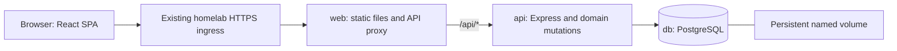

# Separate client, API, and PostgreSQL

Status: proposed design; this PR changes documentation only.

Reviewed: 2026-09-19, against `9a2b61c` on `main`.

## Recommendation

Keep React/Vite, move persistence into a TypeScript Express API, and store the editable collection in PostgreSQL. Keep one repository, one deployment, and three long-running containers: `web`, `api`, and `db`. The browser uses one origin; the web container serves the SPA and forwards `/api` to the API. Git becomes a way to ship software and reference catalogs, not a database synchronization protocol.

This is a storage and application-boundary refactor, not a UI rewrite. Preserve the desk, inventory filters, journal, favorites, refill queue, reference stories, editor navigation, and save feedback. A successful Save means the database transaction committed; there is no subsequent “push data” step.

Jump to the [schema](#3-database-schema), [API](#4-api-contract), [data migration](#6-json-migration-and-backfill), [Docker setup](#7-docker-and-home-server-configuration), [CI/CD](#8-github-actions-and-deployment-flow), or [implementation sequence](#9-implementation-sequence-and-acceptance).

| Area | Decision | Reason |
| --- | --- | --- |
| Client | Existing React, Vite, TypeScript, React Router, and components | The UI and navigation already express the collection well. |
| API | Express 5 + TypeScript + Zod request schemas | Build on the existing Express code; use one API in development and production. |
| Database | PostgreSQL 18, in Docker, with one persistent named volume | Transactions, relationships, constraints, and straightforward SQL suit pens, inks, and journal entries. |
| Database access | Drizzle ORM with `pg`; reviewed, committed SQL migrations | Typed queries without hiding the relational model or introducing a generated client service. |
| Client server state | TanStack Query, initially one collection query | Replace mutable module globals and manual refresh coordination. |
| Repository | npm workspaces: `apps/web`, `apps/api`, `packages/core` | Separate responsibilities without separate repositories or release processes. |
| Delivery | Two application images built from the same commit; Compose runs both plus PostgreSQL | Independent runtimes, one small release unit. |
| CI/CD | GitHub Actions validates and publishes; an infra-owned host updater deploys a successful commit | Keep home-server access and deployment credentials in the existing homelab boundary. |
| Reference research | Keep sourced catalogs and generated swatches in Git | They are reviewed product reference material, not editable collection state. |

Node 24 LTS is the target for development, CI, and API runtime. Use compatible stable package releases and lock exact dependency resolutions during implementation; do not combine this with unrelated library upgrades. Node 24 is an LTS line, and Express 5 supports it. [Node release policy](https://nodejs.org/en/about/previous-releases), [Express migration guide](https://expressjs.com/en/guide/migrating-5/).

### What this deliberately leaves out

No accounts, multiple users, permission roles, Redis, background workers, event bus, GraphQL, Kubernetes, SSR, offline writes, replication, automatic backups, or high availability. No brand/nib taxonomy tables or generic repository/service frameworks. A brief interruption during deployment is acceptable. A persistent database volume is required storage, not a redundancy feature.

SQLite would also be a valid real database at this scale and would remove a container. PostgreSQL is the recommendation because a dedicated database container is already acceptable here and the desired client/API/database split becomes conventional and easy to work with. Scale is not the justification. MongoDB does not simplify these relationships; hosted Supabase adds services this app does not need. Fastify or a full-stack React framework would work, but switching away from the existing Express/SPA structure buys little for this refactor.

## 1. What the code actually does today

The current implementation is more developed than the old architecture summary in `AGENTS.md` suggests:

| Evidence | Current behavior | Consequence for the redesign |
| --- | --- | --- |
| [`server.js`](../../server.js), [`vite-file-api-plugin.ts`](../../vite-file-api-plugin.ts) | Separate production and development HTTP shells, `/api/data`, whole-array pen/ink saves, and network detection | Replace both persistence paths with one API process. |
| [`server/refill-api.js`](../../server/refill-api.js) | Journal mutations already operate on individual entries, serialize writes, compare the expected original, and use atomic file replacement | Preserve stale-edit protection; do not regress to replacing the entire journal. |
| [`dataService.ts`](../../src/services/dataService.ts), [`fileService.ts`](../../src/services/fileService.ts) | Mutable browser arrays; pen/ink CRUD returns before persistence completes; favorites await saves and journal requests are asynchronous | All mutations should have explicit pending/success/error behavior. |
| [`RefillEditor.tsx`](../../src/components/collection/RefillEditor.tsx) | Saves the event, then separately updates the pen's refill flag | Move both effects into a single database transaction. |
| [`collection.ts`](../../src/lib/collection.ts) | Derives latest pairing from calendar date and array position; interprets `NONE` as cleaning; excludes future entries from current pairing | Preserve these rules explicitly in the schema, import, and selectors. |
| [`useEditorNavigation.ts`](../../src/hooks/useEditorNavigation.ts) | Editor URLs and history include journal array indices, with fallback matching when indices shift | Replace event identity with stable IDs; retain drafts, Back/Forward, filters, and scroll restoration. |
| [`inkReference.ts`](../../src/lib/inkReference.ts) | Pilot/Wearingeul catalogs are bundled and joined by brand and stable ink ID | Preserve IDs and provenance; these catalogs do not need CRUD endpoints. |
| [`LocalNetworkContext.tsx`](../../src/context/LocalNetworkContext.tsx), `server.js` | UI disables edits outside the local network, but mutation routes do not enforce that policy; IP detection accepts forwarded headers | Preserve the intended read-only access behavior with a real server/ingress boundary. |
| [`Dockerfile`](../../Dockerfile), [`docker-compose.yml`](../../docker-compose.yml) | One Express/static image; mounted checkout; Git installed in runtime; Git/Vault environment; private homelab Node base image | Remove the checkout, Git, and deployment credentials from application containers. Coordinate the custom base-image policy with infra. |
| [`checks.yml`](../../.github/workflows/checks.yml), [`build_and_push.yml`](../../.github/workflows/build_and_push.yml) | Checks and publication are independent workflows; image publication does not wait on checks; data paths skip image builds | Make tests a prerequisite for publication. Reference catalog changes must trigger a web build. |

`server.js` comments describe a minute-based host updater, but its implementation and the reverse proxy configuration are outside this checkout. The `homelab-infra` checkout was not available at the expected local path. Deployment below is a proposed contract for that infra, not a claim that its current updater already implements it. No live server was inspected or modified.

### Audited migration input

These are checkout counts, not a verified snapshot of the live mounted directory. Recalculate them at cutover.

| Item | Count / finding |
| --- | --- |
| Pens | 49 |
| Ink rows | 195: 194 actual inks plus the `NONE` placeholder |
| Journal entries | 483: 454 refills and 29 cleanings |
| Mixtures | 38 entries with more than one real ink |
| Real event-to-ink relationships | 504 |
| Residual-ink entries (`notPure`) | 18 |
| Date range | 2024-10-04 through 2026-09-19; no future entries at review time |
| Same-pen, same-day groups | 32; insertion order is meaningful |
| Legacy journal `index` properties | 81; these are not authoritative array positions |
| Exact repeated JSON rows beyond first occurrence | 2; preserve as separate events |
| Non-UUID IDs | 43 pens and 110 real inks; database IDs must accept existing strings |
| Integrity scan | No duplicate pen/ink IDs, orphan references, invalid dates, duplicate inks within an event, or mixed `NONE`/real-ink entries |
| Reference records | 15 Pilot and 21 Wearingeul records, all linked to existing ink IDs |

The current files include `archived`, `needsRefill`, and `colorHex`. The models also support `favorite`, although this snapshot does not have that field populated. Preserve all of them. Do not “clean up” duplicates, rename products, recompute flags, or infer missing research facts during import.

## 2. Application boundaries



The web container contains no collection database or secrets. The API contains no Git checkout and never writes application source. Only PostgreSQL owns mutable collection state. The API and database have no published production host ports. Retain host loopback port `8045` for the web service where that fits the existing ingress; retain `concordia` only on the ingress-facing web service if infra still needs it.

Suggested layout:

```text
apps/
  web/
    src/                    existing components, hooks, styling, routing
    src/reference/          Pilot, Wearingeul, and generated swatch data
    public/                 existing fonts and assets
    vite.config.ts          /api proxy only; no file API plugin
  api/
    src/app.ts              Express factory, middleware, routes
    src/main.ts             configuration, listen, graceful shutdown
    src/routes/             collection, pens, inks, refill-events
    src/services/           only transactional domain operations that need it
    src/db/schema.ts        Drizzle table definitions
    src/db/client.ts        one pg connection pool
    src/db/migrate.ts       compiled migration entry point
    src/commands/import-json.ts
    migrations/            reviewed SQL and Drizzle migration metadata
packages/
  core/src/                 DTO schemas, pure date and collection rules
deploy/
  Dockerfile                shared build stages, web and api runtime targets
  nginx.conf                static delivery and same-origin /api proxy
docker-compose.yml          production topology and migration task
compose.dev.yml             local database, loopback development port
scripts/                    existing research tooling
docs/design/                this proposal
```

Keep one lockfile. `packages/core` must not import React, Express, database drivers, filesystem code, or credentials. Zod schemas define request/response DTOs and inferred TypeScript types; Drizzle types stay inside the API. This prevents a database column rename from accidentally changing the public JSON contract. Use explicit mapping between snake_case database columns and camelCase DTOs.

Routes validate inputs and translate errors. Domain functions own operations such as recording a refill and changing its pen's queue state. Drizzle calls can live directly in those functions; do not introduce an interface and implementation class for every table.

### Client behavior

Replace `dataService.ts`'s global arrays with a single `useQuery(['collection'])` and typed fetch functions. Keep the aggregate read: under 500 journal entries does not justify paginated client joins or separate requests for every dashboard tile. Search, filtering, grouping, and derived views can remain in pure selectors.

`GET /api/collection` returns `{ pens, inks, events, asOf, capabilities: { canEdit } }`. Fetch rows inside one short, read-only repeatable-read transaction so a simultaneous mutation cannot produce a response with a new event and an old pen flag. Order events and event ink lists explicitly; never depend on database return order.

Use a short `staleTime` such as 30 seconds, refetch on focus/reconnect, and invalidate after a successful mutation. Set mutation retries to zero; do not silently resubmit a create after an uncertain network result. Keep the draft on failure and offer a collection refresh before the user retries. Disable duplicate submits while pending. TanStack Query's stale/refetch behavior is configurable rather than an implicit infinite cache. [Query defaults](https://tanstack.com/query/latest/docs/framework/react/guides/important-defaults).

Initially wait for confirmation on all mutations, including favorites. This avoids a second rollback implementation while moving persistence. A saved event response includes any changed pen; update the cache from the committed response, then invalidate. If the subsequent refetch fails, report a refresh problem without telling the user the already-committed write failed. Preserve save celebrations, but trigger them only after commit confirmation.

Local storage continues to hold layout preferences; URL state holds filters and navigation. Unsaved editor drafts remain browser state. Remove the Git-oriented `SaveDialog`, `DirtyStateContext`, and mutation callback when cutover is complete. Keep `useDraft` and editor navigation guards: “unsaved form” still matters even though “saved but unpushed” disappears.

Replace journal `index` addressing with `event.id` throughout routes, React keys, editor history, and drafts. Keep a separate sequence for ordering. New editor links use stable IDs. Do not guess which event an old numeric-index bookmark means; show a short “Reopen this entry from the journal” message. Pen/ink links retain their existing IDs.

## 3. Database schema

Use four domain tables, one small import-receipt table, and Drizzle's migration bookkeeping. No stored current-ink column, cached refill counts, or materialized dashboard tables.

The following SQL specifies the intended constraints and types; implementation should generate/review equivalent migration SQL through Drizzle. All editable entities have a `version` for stale-tab detection and timestamps for database record maintenance. Imported `created_at` is the import time, not an invented historical fill time.

```sql
CREATE TABLE pens (
  id text PRIMARY KEY DEFAULT gen_random_uuid()::text,
  brand text NOT NULL,
  model text NOT NULL,
  color text NOT NULL,
  nib_size text NOT NULL,
  nib_type text NOT NULL,
  archived boolean NOT NULL DEFAULT false,
  favorite boolean NOT NULL DEFAULT false,
  needs_refill boolean NOT NULL DEFAULT false,
  version integer NOT NULL DEFAULT 1 CHECK (version > 0),
  created_at timestamptz NOT NULL DEFAULT now(),
  updated_at timestamptz NOT NULL DEFAULT now()
);

CREATE TABLE inks (
  id text PRIMARY KEY DEFAULT gen_random_uuid()::text CHECK (id <> 'NONE'),
  brand text NOT NULL,
  collection text NOT NULL DEFAULT '',
  name text NOT NULL,
  color_hex text CHECK (color_hex ~ '^#[0-9A-Fa-f]{6}$'),
  archived boolean NOT NULL DEFAULT false,
  favorite boolean NOT NULL DEFAULT false,
  version integer NOT NULL DEFAULT 1 CHECK (version > 0),
  created_at timestamptz NOT NULL DEFAULT now(),
  updated_at timestamptz NOT NULL DEFAULT now()
);

CREATE TABLE refill_events (
  id text PRIMARY KEY DEFAULT gen_random_uuid()::text,
  pen_id text NOT NULL REFERENCES pens(id) ON DELETE RESTRICT,
  occurred_on date NOT NULL,
  kind text NOT NULL CHECK (kind IN ('refill', 'cleaning')),
  notes text NOT NULL DEFAULT '',
  not_pure boolean NOT NULL DEFAULT false,
  sequence integer GENERATED BY DEFAULT AS IDENTITY UNIQUE NOT NULL,
  version integer NOT NULL DEFAULT 1 CHECK (version > 0),
  created_at timestamptz NOT NULL DEFAULT now(),
  updated_at timestamptz NOT NULL DEFAULT now(),
  CHECK (kind <> 'cleaning' OR not_pure = false)
);

CREATE TABLE refill_event_inks (
  event_id text NOT NULL REFERENCES refill_events(id) ON DELETE CASCADE,
  ink_id text NOT NULL REFERENCES inks(id) ON DELETE RESTRICT,
  position integer NOT NULL CHECK (position >= 0),
  PRIMARY KEY (event_id, ink_id),
  UNIQUE (event_id, position)
);

CREATE INDEX refill_events_pen_date_idx
  ON refill_events (pen_id, occurred_on DESC, sequence DESC);
CREATE INDEX refill_event_inks_ink_idx ON refill_event_inks (ink_id);

CREATE TABLE data_imports (
  id text PRIMARY KEY,
  source_sha256 text NOT NULL,
  counts jsonb NOT NULL,
  imported_at timestamptz NOT NULL DEFAULT now()
);
```

Text IDs retain `pen_…`, `ink_…`, and existing UUIDs. New records receive UUID strings. Brand/model/name are not unique: multiple similar pens and repeated fills are legitimate. Keep nib sizes/materials as text rather than introducing enums that would reject an unusual nib. Missing legacy booleans become `false`; absent `colorHex` becomes SQL `NULL`.

The event date is a PostgreSQL `date`, exposed as a `YYYY-MM-DD` string; do not round-trip it through UTC JavaScript timestamps. Use Drizzle's date string mode. Database maintenance timestamps use `timestamptz`. [PostgreSQL date/time types](https://www.postgresql.org/docs/18/datatype-datetime.html).

### Domain invariants

1. **Cleaning is an event type.** A cleaning has zero ink links and `notPure = false`. A refill has one or more distinct ink links, ordered by `position`. Remove `NONE` from live data and API DTOs. `notPure` means residual ink, not the same thing as deliberately selecting multiple inks; preserve it independently.
2. **Latest pairing is derived.** Choose the event for a pen with `occurred_on <= asOf`, ordered by date descending, then sequence descending. A cleaning means empty. Editing keeps the sequence; deleting never renumbers surviving events. A new same-day event wins. A pen with no event is empty.
3. **Queue intent remains independent.** Only creating an event that becomes today's latest event changes the queue automatically: a refill clears `needsRefill`; a cleaning applies an optional queue choice, otherwise leaves the flag as-is. Backdated creations that do not become latest, all edits, and all deletions leave the flag alone. Explicit pen edits can always change it. Archived pens remain excluded from the visible queue.
4. **Archive preserves history.** Referenced pens/inks cannot be hard-deleted; return a conflict that offers archive instead. Unreferenced items may be deleted. Existing historical relationships can retain archived items; new selections offer active inventory. Do not reject an unchanged archived relationship when editing its old event.
5. **History stays history.** Counts include historical refill events as today, exclude cleanings, and do not discard an event because its pen or ink is archived. Retain future imported history if encountered, but exclude it from current pairing. Normal create/edit requests continue to reject future dates, matching the existing editor; an imported future event can be corrected to an allowed date.
6. **One calendar policy.** Use `APP_TIME_ZONE=America/Chicago` and return the server's `asOf`. Both API queue decisions and client selectors use it. This intentionally replaces the current browser-local “today” so travel/time-zone differences cannot make the UI and API disagree. Refresh the collection on local day rollover in that configured zone, and on window focus.

Enforce foreign keys, uniqueness, and row-local checks in PostgreSQL. Validate event type versus ink-link count inside the API/import transaction: an ordinary SQL `CHECK` cannot validate rows in a different table. No trigger framework is necessary when these are the only write paths. [PostgreSQL constraint limits](https://www.postgresql.org/docs/18/ddl-constraints.html).

For event mutations, lock affected pen rows before computing latest-event/queue effects; edits that move an event to another pen lock both in a consistent ID order. Serialize relevant event changes with the same lock convention. Update the event, its links, and any pen flag in one transaction. Direct pen patches use version-checked updates; a queue change also increments the pen version. Every successful entity update increments `version` and sets `updated_at` explicitly; the SQL defaults do not do that automatically.

## 4. API contract

Use a small JSON REST API under `/api`. No filename arguments or arbitrary bulk replacement endpoint.

| Method / path | Meaning |
| --- | --- |
| `GET /api/collection` | Complete collection, effective date, and edit capability |
| `POST /api/pens`, `POST /api/inks` | Create one inventory record; server assigns ID |
| `PATCH /api/pens/:id`, `PATCH /api/inks/:id` | Change supplied fields, including favorite/archive/queue flags |
| `DELETE /api/pens/:id`, `DELETE /api/inks/:id` | Delete an unreferenced inventory record |
| `POST /api/refill-events` | Create an event and atomically apply eligible queue effects |
| `PUT /api/refill-events/:id` | Replace editable event fields and links, preserving ID/sequence |
| `DELETE /api/refill-events/:id` | Delete that event and its ink links; preserve queue intent |
| `GET /health/live` | Process is alive |
| `GET /health/ready` | Database reachable and expected migrations applied |

Example create body:

```json
{
  "penId": "pen_1",
  "date": "2026-09-19",
  "kind": "refill",
  "inkIds": ["ink_35"],
  "notes": "Fresh fill",
  "notPure": false
}
```

For a cleaning use `kind: "cleaning"`, `inkIds: []`, and optionally `needsRefill: true/false` on **creation only**. That flag is a command input, never a historical event column. A server check determines whether it is eligible to affect today's queue.

Use strict Zod schemas, real calendar validation, bounded input/body sizes, field allowlists, and existence checks. Reject client-supplied `sequence`, legacy `index`, timestamps, and server IDs on create. PATCH merges only provided fields; omitted values remain unchanged. Explicit `colorHex: null` clears an override. Unknown or malformed input returns `400`, unknown IDs `404`, stale versions and referenced deletes `409`, denied writes `403`, and database unavailability `503`. Return structured `{ error: { code, message, fields? } }` without SQL internals.

Updates and deletes include `expectedVersion`. Use an atomic `WHERE id = ? AND version = ?` update/delete, not a separate unprotected comparison. For event edits, perform the version check and link replacement in the same transaction. Return `409` if it changed; retain the user's draft and require refresh/review. This is protection against two tabs and old forms, not a multi-user feature. Return `201` with the committed record for creation, `200` with the committed record/affected pen for updates, and `204` for deletion.

### Preserve the intended editing boundary

Do not add an account system. Preserve public/read-only browsing if the current ingress exposes it, with writes allowed only through the trusted home-network path. The existing UI check is not authorization.

Implement that decision at ingress and API: the trusted ingress strips incoming edit-capability headers and sets a verified `X-Collection-Can-Edit` value after applying its source-network policy. The web proxy forwards only that established value; all mutation routes require it. The API defaults to read-only when the value is absent. This requires the web origin to be reachable only through trusted ingress, and the API only through web; an untrusted sibling container must not be able to bypass that boundary. If loopback access is used operationally, it remains read-only unless explicitly routed through the trusted policy.

Require same-origin browser write requests, including an allowed `Origin` and JSON content type. Do not enable broad CORS. In local development, a separate explicit development setting enables writes, with both Vite and API bound to loopback. No production “fail open” mode. Return `capabilities.canEdit` to drive UI affordances; remove `/api/is-local`. If infra instead makes the entire app LAN/VPN-only, that can simplify the ingress policy without changing the data model.

The exact ingress allowlist/proxy trust configuration must be checked in `homelab-infra` before implementation. Express warns that blindly trusting forwarding headers can allow the client to supply them; do not copy today's header parsing. [Express proxy guidance](https://expressjs.com/en/guide/behind-proxies/).

## 5. Reference data and developer workflow

Move `pilot-inks.json`, `wearingeul-inks.json`, and the frontend swatch artifact into `apps/web/src/reference/`. Update the research scripts' output paths and their tests; continue producing the reviewed CSV companion where appropriate. Keep source URLs, Japanese names/readings, null/unknown properties, and catalog-level retrieval metadata intact.

Keep the current swatch precedence: explicit database `colorHex`, then manufacturer reference RGB when present, then the generated approximate swatch, then unknown. Preserve the existing stable-ID catalog association. The generated swatch fallback currently keys by ink name; retain that behavior for this refactor rather than inventing a catalog reconciliation migration. Database deletion may leave an unused reference entry, which is harmless and must not recreate inventory.

Mutable `pens.json`, `inks.json`, and `refillLog.json` stop being runtime inputs after cutover. Keep the approved import fixture under `migration-data/legacy-json-v1/` until the transition is complete, clearly marked immutable and excluded from application images. No build, app startup, or recurring deployment automatically seeds or reimports it. Git history can retain it afterward; normal data edits are exclusively database changes. A fresh developer database can explicitly import that fixture or a small test fixture.

Proposed root commands:

```text
npm ci
docker compose -f compose.dev.yml up -d db
npm run db:migrate
npm run db:import-json -- --source ./migration-data/legacy-json-v1 --dry-run
npm run db:import-json -- --source ./migration-data/legacy-json-v1
npm run dev             # Vite + the same API, with watched TypeScript
npm test
npm run lint
npm run build
```

Use Vite's proxy to a loopback API port; delete `vite-file-api-plugin.ts`. A tiny process runner may start both workspace dev scripts. `DATABASE_URL` is server-only and never a `VITE_*` variable. Development uses its own named volume/database; tests use disposable databases. Document these commands and replace stale architecture guidance in `AGENTS.md` during implementation.

## 6. JSON migration and backfill

Separate **schema migration**, **one-time historical import**, and **test/development seed**. They are different commands. Do not put live data loading into PostgreSQL's first-start init directory or run it on API startup.

### Import algorithm

1. Read all three source files from an explicit directory. Produce a manifest with source SHA if known, capture time, SHA-256 per file, a combined checksum in fixed filename order, counts, and validation findings. A source SHA alone does not describe uncommitted live file edits.
2. Parse and validate the entire snapshot before writing. Check unique inventory IDs, valid calendar dates, booleans/colors, non-orphan references, and well-formed ink arrays. Report unknown fields and suspicious values with filenames/array positions. The documented legacy `index` field is allowed but discarded. Abort on unexplained anomalies rather than silently coercing or dropping rows.
3. Copy pen and real-ink IDs verbatim. Preserve text, notes, mixtures, custom colors, archived/favorite/refill flags; normalize absent optional booleans to `false`. Exclude the `NONE` inventory row.
4. Iterate journal records in **actual source array order**. Give row at zero-based position `i` the deterministic text ID `legacy-refill-${i + 1}` and sequence `i + 1`. Ignore its embedded `index`, if any. Preserve duplicate rows as distinct records. Map only `NONE`/empty ink arrays to cleaning with no links; reject a mixture of `NONE` and real inks. Preserve real ink order using zero-based link positions. Preserve `notPure`; flag impossible cleaning/purity combinations rather than silently losing them.
5. In one transaction, serialize import attempts, require empty domain tables, insert pens/inks/events/links, and validate counts and behavior. Insert receipt `data_imports.id = 'legacy-json-v1'` with the combined checksum and counts in that same transaction. On a repeated invocation with a matching receipt/checksum, report “already imported” and do nothing. A different checksum or existing domain rows without the matching receipt is an error. Do not upsert over subsequent user edits.
6. Advance the event identity sequence so the next new event sorts after all imported events (for this snapshot the next sequence is 484). Gaps are fine. Sequences are not historical event IDs, and edits/deletions must never recycle them.
7. Before commit, compare normalized rows, ordered links, flags, notes, and derived views against the source. Verify current pen/ink pairings, refill counts, untried inks, favorites, archived filters, and refill queue; also evaluate historical dates that exercise same-day ties. Exclude only deliberate representational differences: removed `NONE`, dropped legacy `index`, explicit false defaults, new IDs/timestamps, and separate event type. Roll back the entire import on any unexplained difference.

`--dry-run` performs the same source transformations/validation and reports the intended insert counts without writing. The actual command performs database and parity checks inside the import transaction. The deterministic ID namespace is reserved for this single approved import; normal create routes always generate UUIDs.

For the reviewed snapshot, acceptance counts are **49 pens, 194 inks, 483 events, 504 links, 29 cleanings, and 18 `notPure` events**. All 483 events survive, including both repeated rows. Existing history tests already exercise array-position semantics; extend them to compare the migrated representation.

### Cutover on the home server

1. Rehearse the importer and new stack against a copy in an isolated database. Keep the old production app serving until the rehearsal and behavior checks pass. Build the candidate release without enabling automatic selection of the new topology yet.
2. Disable the old host data-sync/auto-update task and put the site into a short maintenance window. Stop the old app to prevent new JSON writes. Capture the final live mounted JSON files and their manifest now, including uncommitted changes. Do not blindly use the branch fixture or latest Git commit.
3. Start PostgreSQL with its permanent named volume. Run schema migrations once from the chosen API image, then the importer with a temporary read-only mount of the captured input directory. Compare the import report and derived views before allowing writes.
4. Start the matching web/API release, check readiness and the collection response, then switch the existing ingress and end maintenance. Verify that editing persists across API/container restart and that read-only access cannot mutate records. Confirm that no Git operation occurs during startup or save.
5. Disable/remove the legacy data-sync task permanently, remove repo/askpass mounts and Git environment, and activate the new release updater. Only this database-backed stack may accept writes. Do not run dual-write JSON/database modes.

If import or pre-opening checks fail, fix/retry while closed or restore the old app against the unchanged final JSON input. **After the new app accepts writes, the old JSON is no longer current.** Prefer a forward fix; reverting to the JSON server would require a deliberate reverse export and reconciliation, which this proposal does not build. No automatic rollback to stale JSON and no ongoing backup system are part of this scope.

## 7. Docker and home-server configuration

Replace the current single-runtime Dockerfile with shared build stages and two final targets:

| Target / artifact | Contents and behavior |
| --- | --- |
| Workspace build stage | Node 24, `npm ci` from root lockfile, shared package build, API compilation, Vite production build |
| `api` target | Approved Node runtime, production API dependencies including `pg`/Drizzle, compiled API/core/import/migration commands, committed migration SQL; non-root user; port 8080 |
| `web` target | Non-root nginx runtime on port 8080, Vite output, proxy/static configuration; no Node dependencies at runtime |
| `db` | Official PostgreSQL 18 image, pinned tested patch/digest; named volume; no published port |
| `migrate` Compose task | Same exact API image/digest and database configuration, command `node dist/db/migrate.js`; one-shot, not another long-running service |

Build commands will target `web` and `api`, publishing `ghcr.io/yaylinda/fountain-pens-web` and `ghcr.io/yaylinda/fountain-pens-api`. Both include the full source SHA in tags and OCI labels. Keep `linux/amd64`, the current deployment target, unless the actual host architecture changes.

Copy only the required workspace manifests/build inputs before installation for useful layer caching. The runtime API must contain built shared-package exports and their runtime dependencies; test the final image, not just the checkout. The migration/import entry points must run without dev dependencies. Update `.dockerignore` for the workspace layout; exclude `.git`, environment files, live/import fixtures, and secrets while including all web reference assets and migration SQL.

The current private `contrived-com/...-visa` base may have homelab admission or runtime requirements. Do not silently replace it. Infra must provide an approved Node 24 equivalent and approve the web/Postgres images, or explicitly confirm official images are acceptable. If that takes longer, retain approved Node 22 consistently for the first migration and schedule Node 24 separately; the app design does not depend on that upgrade. Validate fork-PR build behavior for whichever base images require authentication.

### Compose contract

- `web`: host loopback `127.0.0.1:8045:8080` where needed; ingress-facing network plus private app network; read-only static files; nginx writable paths on temporary storage.
- `api`: private app and database networks; no published port, no checkout or durable filesystem mount; small `pg` pool (start with max 5); `NODE_ENV`, `PORT`, `DATABASE_URL`, `APP_TIME_ZONE`, and ingress policy configuration only. Gracefully close the listener/pool on termination.
- `db`: private database network; stable volume name such as `fountain-pens-postgres`; PostgreSQL's own user/permissions, not the old host `2010:2010` override. Create a dedicated non-superuser database owner for the API/migration tool; keep cluster bootstrap credentials out of API configuration.
- `migrate`: explicit one-shot profile/task with `restart: "no"`, same private database network; run after database health succeeds and before starting the API release. Start API only when that task exits successfully.
- API health checks use readiness; database health uses `pg_isready`; web health checks static serving, and the deploy smoke check also calls proxied API readiness. Do not mistake a serving nginx error page for a healthy release.
- Use `restart: unless-stopped` for long-running services. Do not run `docker compose down -v` as part of deployment. Keep the Postgres major version explicit; a future major upgrade is a separate database operation, not a floating-tag refresh.

For the PostgreSQL 18 official image, mount the volume at **`/var/lib/postgresql`**, whose default database directory is version-specific. Do not copy the PostgreSQL 17 `/var/lib/postgresql/data` volume target into this deployment. [Official image storage documentation](https://hub.docker.com/_/postgres).

Compose can wait for `service_healthy` and `service_completed_successfully`, but ordinary startup ordering alone does not establish database readiness. The deploy script should explicitly sequence database health, migration completion, and application start. [Compose startup conditions](https://docs.docker.com/compose/how-tos/startup-order/).

Preserve current HTTP delivery behavior in nginx: compress text responses, immutable year-long caching for fingerprinted assets, HTML revalidation, API `no-store`, missing assets as 404s, and history fallback only for client routes. Unknown `/api` paths must return API errors, never `index.html`. Test that proxying preserves `/api` paths. Recreate/reload web with each API replacement so nginx resolves the current Compose service address; include that path in restart/deploy checks.

### Secrets and ownership

Continue the documented infra boundary: deploy auth lives in Vault at `secret/homelab/deploy-auth/fountain-pens` and is used by the **host updater** for GitHub/HTTPS Git/GHCR access. Remove deploy PATs, `GIT_ASKPASS`, Git author settings, and Vault deployment credentials from app containers.

This repo defines its required app-secret schema (database connection credentials); `homelab-infra` provisions/resolves values and injects them at runtime. No credentials enter image builds or `VITE_*` settings. If infra materializes temporary environment/secret files, keep them permission-restricted and outside version control. The host uses temporary Docker auth configuration rather than persistent `~/.docker/config.json` or `~/.git-credentials`, as the existing policy requires.

## 8. GitHub Actions and deployment flow

### CI and publication

Consolidate the two current workflows into one delivery workflow with explicit dependencies:

```text
pull request  -> check (lint, types, domain/UI/API/import tests)
              -> build and smoke-test both images (no publish)

push main     -> same checks -> build both images -> image smoke tests
              -> publish both SHA-tagged images -> successful release run

home updater  -> select successful main run -> pin matching images
              -> migrate -> recreate web/API -> readiness -> mark deployed
```

Keep tests on GitHub-hosted runners with a PostgreSQL service matching the production major. Test both an empty schema install and upgrade from the previous fixture/schema. CI seeds only disposable data. No production database credentials or homelab runner are needed for PRs.

Use `needs: check` before build/publication. Smoke-test the final API image against PostgreSQL, including its migration command, and test HTTP responses through the final web image. Use existing Node test/Testing Library tooling where useful; no need to replace the runner just to rearrange directories. These HTTP/DOM checks do not require browser automation.

Only trusted `push` runs on `refs/heads/main` publish deployable images. `workflow_dispatch` is available for validation, but is not an implicit production release. PR jobs get `contents: read`; only the publication job gets `packages: write`. Prefer `GITHUB_TOKEN` for GHCR publication, with a separate read credential only if the private approved base requires it. Never pass private registry credentials to fork PRs; if the runtime base remains private, run normal checks and report that the private-image job was skipped. Pin action versions/digests according to the repo's chosen update policy at implementation time.

Start without complicated path filters. Reference data is a build input, so the current blanket `src/data/**` exclusion is wrong for the new layout. A documentation-only merge may run the pipeline; optimize that later without leaving a permanently pending required check. Remove automatic production publication from `master`/version-tag events unless a real second release channel is needed.

Tag both images `sha-<full commit SHA>`, never overwrite a previously published SHA tag, and report their content digests in the run summary. If a rerun finds both tags already published, verify their source labels and reuse the pair; if only one exists, verify/reuse it and publish the missing image before the run can succeed. Moving `prod`/`latest` aliases may exist for convenience, but the deployment must not select them independently. A failed run that published only one image is not a deployable release.

### Continuous deployment stays on the host

Use the existing style of host polling, with an updated infra-owned script, rather than introducing SSH access from GitHub or running arbitrary PR jobs on the home server. Each poll:

1. Acquire a host deployment lock. Query runs for this specific delivery workflow with branch `main`, event `push`, and conclusion `success`. Select the newest eligible source commit descended from the deployed commit, not whichever rerun happened to finish most recently. Paginate as needed and verify ancestry against fetched `main`; the host may keep a code checkout for this, but it is never mounted into the app. Skip already deployed SHAs and unexpected non-descendant history. The Actions API exposes run filtering and `head_sha`; add Actions read permission to the existing deploy credential if required. [GitHub workflow-runs API](https://docs.github.com/en/rest/actions/workflow-runs#list-workflow-runs-for-a-workflow).
2. Fetch deployment files from that exact source SHA into a host release directory. Resolve both SHA image tags to digests, verify source labels, and persist one release record containing source SHA, workflow run ID, both digests, and migration result. A single local record is enough; no release service is needed.
3. Pull both images and confirm the configured database image is present before changing the running app. Keep the current deployment if a fetch/pull fails. Resolve Vault credentials on the host as today; do not write them into the source checkout.
4. Enter a brief maintenance window and stop web/API, leaving PostgreSQL running. Wait for DB health, run the one-shot migration from the pinned candidate API image, then recreate both web/API from the same release record and matching Compose revision. No runtime auto-seed and no frontend rebuild on the host.
5. Check direct and proxied readiness, API collection response shape, and SPA/static delivery. Mark the SHA deployed only after those checks succeed. Retain the previous release record for an intentional application rollback; record failure visibly in host logs/status and do not report it as deployed. Avoid reattempting a failed SHA every minute; require an explicit retry or a newer eligible release.

This deliberately means **GitHub Actions success confirms a tested, published release; host readiness confirms deployment**. An Actions run does not claim the home server is healthy. No inbound GitHub-to-homelab connection is needed.

Use forward, reviewed migrations. Generate SQL with Drizzle, inspect it, commit it, and apply it through the built migrator; never use schema `push` in production. Prefer additive changes while old/new releases might need to coexist during a rollback. If migration or health fails, only restart the prior API when its schema compatibility is known; otherwise keep maintenance active and fix forward. Do not automatically reverse schema changes or assume an image rollback reverses data. [Drizzle migration workflow](https://orm.drizzle.team/docs/migrations).

The first database cutover is manually coordinated using section 6, not automatically activated by merging a partially implemented branch. After cutover, ordinary tested `main` changes follow the host polling process above. Infra owns the updater, ingress, networks, host secret injection, and base-image approvals; this repo owns application images, Compose service requirements, schema/migrations, and tests.

## 9. Implementation sequence and acceptance

Keep these as a small sequence of reviewable changes. There is no need to ship every intermediate state to production.

| Phase | Deliverable | Acceptance |
| --- | --- | --- |
| 1. Boundaries | Workspaces, shared DTO/domain package, TypeScript API skeleton, dev DB/proxy | Existing collection/navigation tests still pass; development uses the real API rather than Vite persistence middleware. |
| 2. Database and importer | Four tables, migrations, import receipt/CLI, aggregate read, fixture conversion | Audited snapshot imports without loss; a repeated import is a no-op; failed import leaves no partial records. |
| 3. Mutations | Record-level routes, versions, atomic event/queue writes, edit policy | Constraint/error/transaction tests pass against real PostgreSQL. |
| 4. Client integration | Query-backed state, async editors, stable event links, removal of Git data tools | Current workflows retain behavior; errors keep drafts; saving no longer means pushing Git. |
| 5. Delivery | Two runtime images, Compose, gated workflow, coordinated infra updater change | Candidate images work through web proxy; migration failure prevents activation; volumes survive recreation. |
| 6. Cutover and cleanup | Final stopped-writer import, switch ingress, remove JSON persistence/sync | Live import report matches captured input; writes persist; legacy stack cannot write; docs reflect the new setup. |

Required behavior coverage:

- Preserve same-day event order, mixtures and their display order, residual ink, historical duplicates, cleaned/empty state, archives, favorites, and custom swatch precedence.
- Current refill clears only the relevant pen's queue; current cleaning applies its choice; historical creation/edit/delete does not change queue intent. Transaction failure leaves both event and pen unchanged.
- Stale versions return conflicts; deleting a referenced pen/ink fails; duplicate ink links and malformed dates fail; failed form submissions retain their contents. A timed-out create is not automatically replayed.
- Stable IDs still open the correct event after another event is deleted. Back/Forward, filters, scroll restoration, nested creation, and unsaved-draft guards keep their existing behavior.
- Import ignores embedded `index`, preserves repeated rows, rejects unexplained fields/orphans, checks per-field parity, and advances the sequence correctly. Source changes after a completed import cannot overwrite the database.
- Test actual PostgreSQL transactions/constraints rather than mocking Drizzle. Use disposable databases and temporary JSON fixtures; never write production files in tests.
- Runtime tests verify migrations from the final image, readiness failure when DB/schema is unavailable, persistence after container recreation, API errors versus SPA fallback, caching, and denied writes from an untrusted path.

Follow the repository validation cadence: batch checks after coherent implementation phases. Use unit, DOM, API integration, build, and HTTP container checks by default. Local browser verification remains opt-in under the existing `AGENTS.md` instructions.

## 10. Decisions still needing an infra check

These do not block reviewing the design or require adding product features:

1. Inspect the real ingress and host updater: preserve intended public browsing/LAN editing, choose the exact trusted path, and identify the task that currently syncs JSON.
2. Confirm approved Node/web/Postgres base images, private registry access, Compose version, and whether `concordia` or host loopback is the active ingress route.
3. Extend the host deploy credential's package access to the two new GHCR images and Actions read access where necessary, while retaining the canonical Vault ownership.
4. At cutover, identify the live data directory and recalculate its manifest/counts; the checkout audit is a rehearsal baseline, not production authority.

The default product decisions are otherwise made: PostgreSQL, one TypeScript API, the existing SPA, a single shared origin, versioned static research, and no additional infrastructure services.
